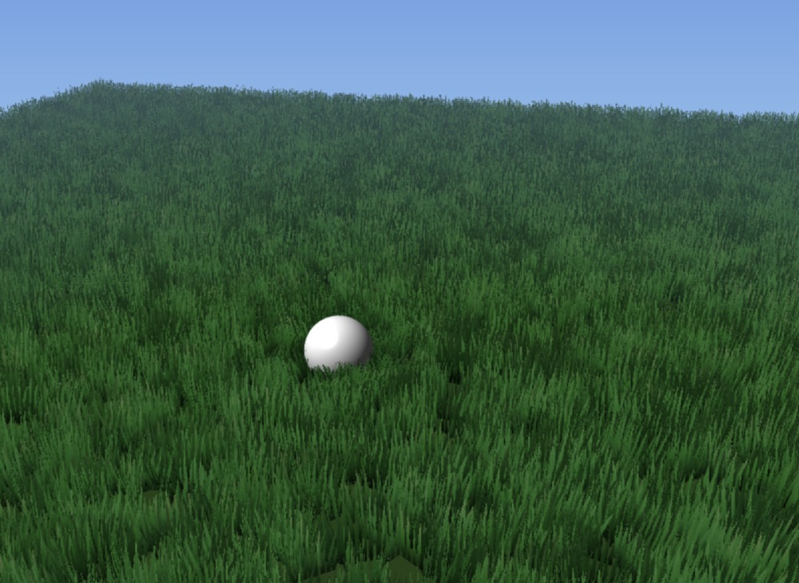
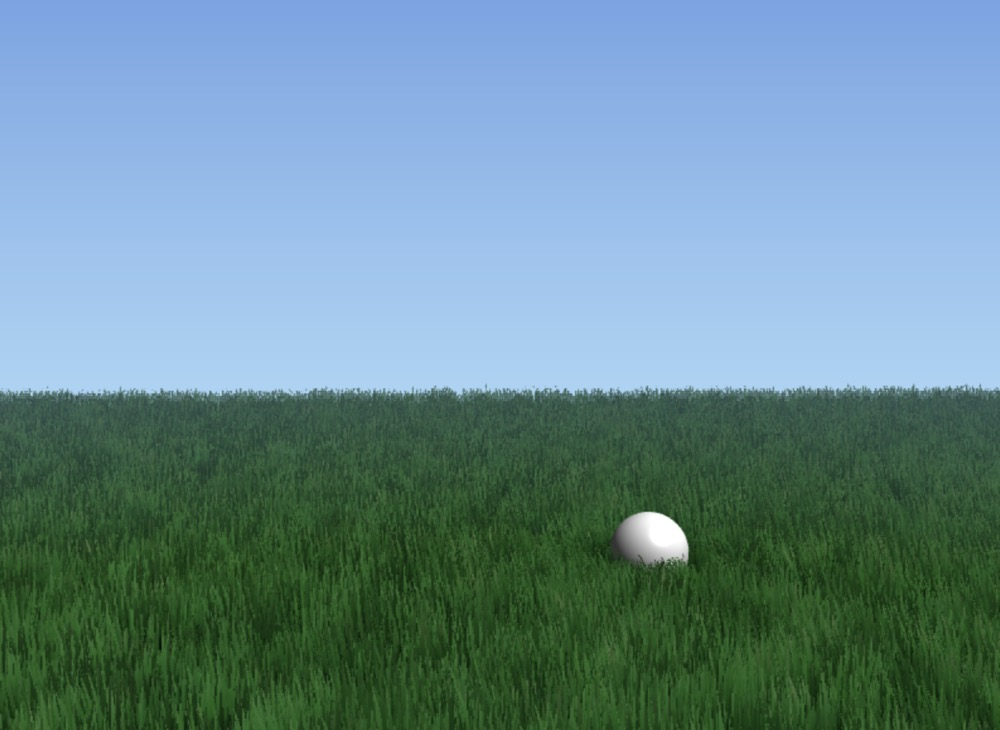

# Metal-Grass

A real-time grass rendering demo built with Metal (C++/MSL) featuring procedural wind animation, persistent interaction trails, and atmospheric rendering.

## Technical Highlights

• **Implemented persistent trample map system** using compute shaders (`TrampleCompute.metal`) with ping-pong R16Float textures for real-time grass interaction trails that decay over time, enabling dynamic footprint visualization without per-frame geometry updates.

• **Developed procedural wind physics** in `Shaders.metal` combining idle chaos, Roystan-style fluid wind waves, and turbulence noise to generate natural grass swaying with proper normal rotation for accurate lighting on bent geometry.

• **Built multi-pass rendering pipeline** (`Renderer.cpp`) with separate Sky, Ground, Grass, and Ball passes, implementing fullscreen triangle sky rendering (`SkyShaders.metal`) with exponential fog and proper depth state management for correct layering.

• **Applied rendering techniques** including wrap diffuse lighting, Reinhard tone mapping, distance fog, tip translucency, and analytic antialiasing using `fwidth()` derivatives for smooth alpha edges in the grass fragment shader.

• **Optimized grass rendering** with instanced rendering (20K+ blades), MSAA with alpha-to-coverage, procedural color gradients, and low-frequency world-space color variation to avoid uniform "one-pot green" appearance.

